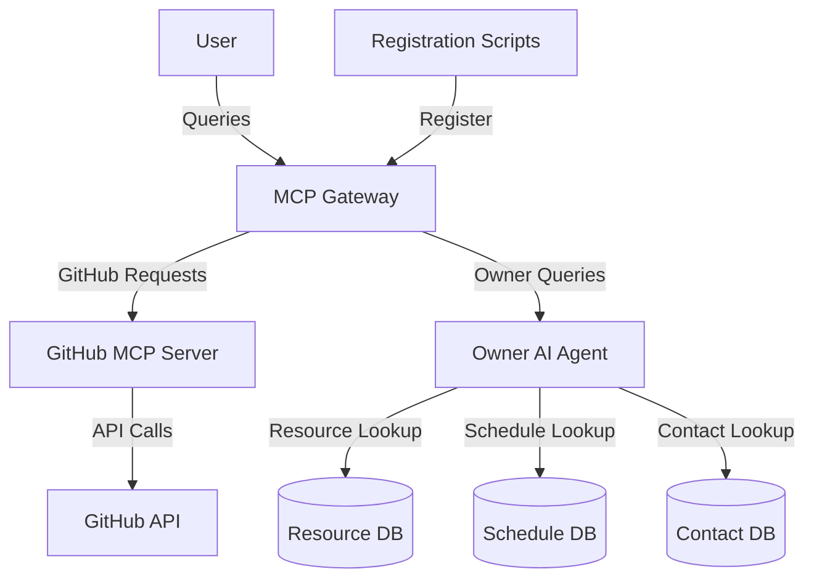

# Instana Integration for MCP Gateway

This integration allows Instana customers to configure external remote MCP servers and A2A compatible AI Agents. It provides tools for accessing GitHub repositories and issues, as well as an AI Agent for finding resource owners and determining the best way to contact them.

## Table of Contents

- [Overview](#overview)
- [Components](#components)
- [Installation](#installation)
- [Configuration](#configuration)
- [Usage](#usage)
- [Development](#development)
- [Troubleshooting](#troubleshooting)

## Overview

The Instana Integration consists of three main components:

1. **GitHub MCP Server**: A Model Context Protocol (MCP) server that provides tools and resources for accessing GitHub repositories and issues.
2. **Owner AI Agent**: An AI Agent that uses the ReAct pattern to help users identify resource owners and determine the best way to contact them.
3. **Registration Scripts**: Scripts for registering the GitHub MCP server and Owner AI Agent with the MCP Gateway.



## Components

### GitHub MCP Server

The GitHub MCP server provides tools and resources for accessing GitHub repositories and issues. It includes:

- **Tools**:
  - `getRepositoryCode`: Get code from a GitHub repository
  - `searchCode`: Search for code in a GitHub repository
  - `getIssues`: Get issues from a GitHub repository
  - `createIssue`: Create a new issue in a GitHub repository
  - `commentOnIssue`: Add a comment to an existing issue

- **Resources**:
  - `github://repository/{owner}/{repo}`: Access a GitHub repository
  - `github://repository/{owner}/{repo}/file/{path}`: Access a file in a GitHub repository
  - `github://repository/{owner}/{repo}/issues`: Access issues in a GitHub repository
  - `github://repository/{owner}/{repo}/issues/{number}`: Access a specific issue in a GitHub repository

For more details, see the [GitHub MCP Server documentation](github-mcp/README.md).

### Owner AI Agent

The Owner AI Agent helps users identify resource owners and determine the best way to contact them based on availability and time of day. It includes:

- **Tools**:
  - `findResourceOwner`: Find the owner of a specific resource
  - `listOwnedResources`: List resources owned by a specific person
  - `findTeamResources`: Find resources owned by a specific team
  - `checkOnDutyStatus`: Check if a person is currently on duty
  - `getOnCallRotation`: Get the current on-call rotation for a team
  - `getContactPreferences`: Get a person's contact preferences
  - `recommendContactMethod`: Recommend the best way to contact a person
  - `notifyPerson`: Send a notification to a person

For more details, see the [Owner AI Agent documentation](owner-ai-agent/README.md).

### Registration Scripts

The registration scripts are used to register the GitHub MCP server and Owner AI Agent with the MCP Gateway. They include:

- **Scripts**:
  - `register:github`: Register the GitHub MCP server
  - `register:owner`: Register the Owner AI Agent
  - `register:all`: Register both components
  - `unregister:github`: Unregister the GitHub MCP server
  - `unregister:owner`: Unregister the Owner AI Agent
  - `unregister:all`: Unregister both components

For more details, see the [Registration Scripts documentation](registration-scripts/README.md).

## Installation

### Prerequisites

- Node.js 18 or later
- MCP Gateway running and accessible
- GitHub API token (for the GitHub MCP server)
- Resource ownership data (for the Owner AI Agent)

### Installation Steps

1. Clone the repository:

```bash
git clone https://github.com/instana/mcp-context-forge.git
cd mcp-context-forge/instana-integration
```

2. Install dependencies for each component:

```bash
# GitHub MCP Server
cd github-mcp
npm install

# Owner AI Agent
cd ../owner-ai-agent
npm install

# Registration Scripts
cd ../registration-scripts
npm install
```

## Configuration

### GitHub MCP Server

Create a `.env` file in the `github-mcp` directory with the following content:

```
PORT=3000
GITHUB_API_TOKEN=your_github_api_token
CACHE_TTL=3600
RATE_LIMIT_WINDOW=60000
RATE_LIMIT_MAX=60
LOG_LEVEL=info
```

### Owner AI Agent

Create a `.env` file in the `owner-ai-agent` directory with the following content:

```
PORT=3001
OPENAI_API_KEY=your_openai_api_key
LOG_LEVEL=info
```

Also, prepare the data files:

- `data/resources.json`: Resource ownership data
- `data/schedules.json`: Work schedules and availability data
- `data/contacts.json`: Contact preferences data

Example formats for these files can be found in the [Owner AI Agent documentation](owner-ai-agent/README.md).

### Registration Scripts

Create a `config/default.json` file in the `registration-scripts` directory with the following content:

```json
{
  "mcpGateway": {
    "url": "http://localhost:8000",
    "apiKey": "your_mcp_gateway_api_key"
  },
  "githubServer": {
    "name": "github-mcp-server",
    "description": "MCP server for GitHub integration",
    "url": "http://localhost:3000",
    "type": "remote"
  },
  "ownerAgent": {
    "name": "owner-ai-agent",
    "description": "AI Agent for finding resource owners",
    "url": "http://localhost:3001",
    "type": "remote"
  },
  "logging": {
    "level": "info"
  }
}
```

## Usage

### Starting the Components

1. Start the GitHub MCP Server:

```bash
cd github-mcp
npm start
```

2. Start the Owner AI Agent:

```bash
cd owner-ai-agent
npm start
```

3. Register the components with the MCP Gateway:

```bash
cd registration-scripts
npm run register:all
```

### Using the GitHub MCP Server

Once registered, the GitHub MCP server can be used through the MCP Gateway to access GitHub repositories and issues. Here's an example of using the `getRepositoryCode` tool:

```json
{
  "tool": "getRepositoryCode",
  "input": {
    "owner": "instana",
    "repo": "mcp-context-forge",
    "path": "README.md"
  }
}
```

### Using the Owner AI Agent

The Owner AI Agent can be queried through the MCP Gateway to find resource owners and determine the best way to contact them. Here's an example query:

```
Who owns the database server DB001 and what's the best way to contact them right now?
```

The agent will:
1. Look up the owner of DB001
2. Check if they are currently available
3. Determine the best contact method based on their preferences and current time
4. Return a response with this information

## Development

### Project Structure

```
instana-integration/
├── github-mcp/                # GitHub MCP Server
│   ├── src/                   # Source code
│   ├── config/                # Configuration
│   └── README.md              # Documentation
├── owner-ai-agent/            # Owner AI Agent
│   ├── src/                   # Source code
│   ├── config/                # Configuration
│   └── README.md              # Documentation
├── registration-scripts/      # Registration Scripts
│   ├── src/                   # Source code
│   ├── config/                # Configuration
│   └── README.md              # Documentation
└── README.md                  # Main documentation
```

### Adding New Tools

#### GitHub MCP Server

To add a new tool to the GitHub MCP server:

1. Create a new file in `github-mcp/src/tools/` for your tool
2. Implement the tool with the required interface
3. Register the tool in `github-mcp/src/tools/index.js`

#### Owner AI Agent

To add a new tool to the Owner AI Agent:

1. Create a new file in `owner-ai-agent/src/tools/` for your tool
2. Implement the tool with the required interface
3. Register the tool in `owner-ai-agent/src/tools/index.js`

### Testing

Each component includes a test suite that can be run with:

```bash
npm test
```

## Troubleshooting

### Common Issues

#### GitHub MCP Server

- **Rate Limiting**: If you encounter rate limiting issues with the GitHub API, adjust the `RATE_LIMIT_WINDOW` and `RATE_LIMIT_MAX` settings in the `.env` file.
- **Authentication Errors**: Ensure your GitHub API token has the necessary permissions for the repositories you're trying to access.

#### Owner AI Agent

- **OpenAI API Errors**: If you encounter errors with the OpenAI API, check your API key and ensure you have sufficient credits.
- **Data File Errors**: Ensure your data files are properly formatted JSON files.

#### Registration Scripts

- **Connection Errors**: Ensure the MCP Gateway is running and accessible at the URL specified in the configuration.
- **Authentication Errors**: Ensure your API key for the MCP Gateway is correct.

### Logs

Each component writes logs to the console. You can adjust the log level in the configuration files to get more detailed logs for troubleshooting.

## License

This project is licensed under the MIT License - see the LICENSE file for details.