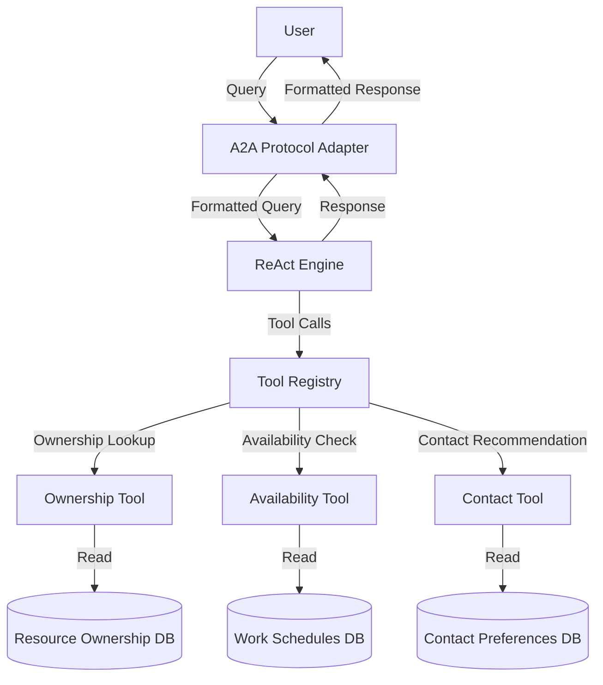

# Owner AI Agent

An AI Agent that uses the ReAct pattern to help users identify resource owners and determine the best way to contact them based on availability and time of day.

## Table of Contents

- [Overview](#overview)
  - [Architecture](#architecture)
  - [Key Components](#key-components)
- [Installation](#installation)
- [Configuration](#configuration)
- [Data Models](#data-models)
- [Usage](#usage)
- [API Reference](#api-reference)
- [Implementation Details](#implementation-details)
- [Integration with MCP Gateway](#integration-with-mcp-gateway)
- [Development](#development)

## Overview

The Owner AI Agent helps users identify resource owners and determine the best way to contact them based on availability and time of day. It provides the following capabilities:

- **Resource Ownership Lookup**: Find the owner of a specific resource or list resources owned by a specific person or team.
- **Availability Checking**: Check if a person is currently on duty or get the current on-call rotation for a team.
- **Contact Recommendation**: Recommend the best way to contact a person based on their preferences, current time, and availability.
- **A2A Protocol Support**: Communicate with other agents using the Agent-to-Agent (A2A) protocol.

### Architecture

The Owner AI Agent is built using the ReAct (Reasoning + Acting) pattern, which allows it to reason about user queries and take appropriate actions to fulfill them. The agent is implemented as a Node.js application that exposes an HTTP API for communication.



### Key Components

#### ReAct Engine

The ReAct engine processes user queries and generates responses using a large language model (LLM) to reason about the query and decide which tools to use. It follows these steps:

1. Receive a user query
2. Generate a thought about how to approach the problem
3. Select an appropriate tool to use
4. Execute the tool with the appropriate input
5. Observe the result of the tool execution
6. Generate a new thought based on the observation
7. Repeat steps 3-6 until a final answer is reached
8. Return the final answer to the user

#### Tool Registry

The tool registry manages all the tools available to the agent. Each tool has a name, description, parameters, and an execute function.

#### A2A Protocol Adapter

The A2A (Agent-to-Agent) protocol adapter translates between the A2A protocol and the internal agent API, handling incoming A2A messages and generating appropriate responses.

## Installation

### Prerequisites

- Node.js 18 or later
- OpenAI API key

### Installation Steps

1. Clone the repository:

```bash
git clone https://github.com/instana/mcp-context-forge.git
cd mcp-context-forge/instana-integration/impl/owner-ai-agent
```

2. Install dependencies:

```bash
npm install
```

3. Create a `.env` file based on the `.env.example` file:

```bash
cp .env.example .env
```

4. Edit the `.env` file and set your OpenAI API key:

```
OPENAI_API_KEY=your_openai_api_key_here
```

## Configuration

The Owner AI Agent can be configured using environment variables:

| Variable | Description | Default |
| --- | --- | --- |
| `PORT` | Port to listen on | `3001` |
| `LOG_LEVEL` | Log level (debug, info, warn, error) | `info` |
| `AGENT_NAME` | Name of the agent | `owner-ai-agent` |
| `AGENT_DESCRIPTION` | Description of the agent | `AI Agent for finding resource owners and contact information` |
| `AGENT_VERSION` | Version of the agent | `1.0.0` |
| `OPENAI_API_KEY` | OpenAI API key | - |
| `OPENAI_MODEL` | OpenAI model to use | `gpt-4` |
| `MAX_ITERATIONS` | Maximum number of iterations for the ReAct engine | `10` |
| `MAX_RESPONSE_TOKENS` | Maximum number of tokens for the response | `1000` |
| `TEMPERATURE` | Temperature for the OpenAI model | `0.2` |
| `DATA_DIR` | Directory for data files | `./data` |

Alternatively, a configuration file (`config/default.json`) can be used with the following structure:

```json
{
  "server": {
    "port": 3001,
    "host": "0.0.0.0",
    "logLevel": "info"
  },
  "agent": {
    "name": "owner-ai-agent",
    "description": "AI Agent for finding resource owners and contact information",
    "version": "1.0.0"
  },
  "react": {
    "maxIterations": 10,
    "maxResponseTokens": 1000,
    "temperature": 0.2
  },
  "llm": {
    "provider": "openai",
    "model": "gpt-4",
    "apiKey": "OPENAI_API_KEY"
  },
  "a2a": {
    "protocolVersion": "1.0",
    "capabilities": ["react", "tools", "memory"]
  },
  "data": {
    "resourcesFile": "./data/resources.json",
    "schedulesFile": "./data/schedules.json",
    "contactsFile": "./data/contacts.json"
  }
}
```

## Data Models

### Resource Ownership

```json
[
  {
    "type": "database",
    "name": "DB001",
    "description": "Main production database",
    "owner": {
      "name": "Jane Smith",
      "email": "jane.smith@example.com",
      "role": "Database Administrator"
    },
    "team": "Infrastructure",
    "backupOwners": [
      {
        "name": "John Doe",
        "email": "john.doe@example.com",
        "role": "Senior Database Administrator"
      }
    ]
  }
]
```

### Work Schedules

```json
[
  {
    "name": "Jane Smith",
    "email": "jane.smith@example.com",
    "timezone": "America/New_York",
    "team": "Infrastructure",
    "workHours": {
      "monday": { "start": "09:00", "end": "17:00" },
      "tuesday": { "start": "09:00", "end": "17:00" },
      "wednesday": { "start": "09:00", "end": "17:00" },
      "thursday": { "start": "09:00", "end": "17:00" },
      "friday": { "start": "09:00", "end": "17:00" }
    },
    "vacations": [
      {
        "startDate": "2023-08-01",
        "endDate": "2023-08-15",
        "note": "Summer vacation"
      }
    ],
    "sickLeave": null,
    "contact": {
      "slack": "@janesmith",
      "email": "jane.smith@example.com",
      "phone": "+1-555-123-4567"
    }
  }
]
```

### Contact Preferences

```json
[
  {
    "name": "Jane Smith",
    "email": "jane.smith@example.com",
    "preferences": [
      {
        "method": "slack",
        "contact": "@janesmith",
        "priority": 1,
        "hours": { "start": "09:00", "end": "17:00" },
        "daysOfWeek": ["monday", "tuesday", "wednesday", "thursday", "friday"]
      },
      {
        "method": "email",
        "contact": "jane.smith@example.com",
        "priority": 2,
        "hours": { "start": "00:00", "end": "23:59" },
        "daysOfWeek": ["monday", "tuesday", "wednesday", "thursday", "friday", "saturday", "sunday"]
      },
      {
        "method": "phone",
        "contact": "+1-555-123-4567",
        "priority": 3,
        "hours": { "start": "09:00", "end": "17:00" },
        "daysOfWeek": ["monday", "tuesday", "wednesday", "thursday", "friday"]
      }
    ],
    "emergencyContact": {
      "method": "phone",
      "contact": "+1-555-123-4567"
    },
    "doNotDisturb": {
      "hours": { "start": "22:00", "end": "07:00" },
      "daysOfWeek": ["monday", "tuesday", "wednesday", "thursday", "friday", "saturday", "sunday"]
    }
  }
]
```

## Usage

### Starting the Agent

```bash
npm start
```

### Data Files

The agent uses three data files to store information:

- `data/resources.json`: Resource ownership data
- `data/schedules.json`: Work schedules and availability data
- `data/contacts.json`: Contact preferences data

Example data files will be created automatically if they don't exist.

### Using the Agent

The Owner AI Agent can be queried through the A2A protocol. Here are some example queries:

#### Finding a Resource Owner

```json
{
  "type": "query",
  "id": "123e4567-e89b-12d3-a456-426614174000",
  "timestamp": "2023-07-15T14:30:00Z",
  "sender": {
    "id": "user-123",
    "name": "User"
  },
  "content": {
    "query": "Who owns the database server DB001?"
  }
}
```

Response:

```json
{
  "type": "response",
  "id": "456e7890-e12b-34d5-a678-426614174000",
  "timestamp": "2023-07-15T14:30:05Z",
  "inResponseTo": "123e4567-e89b-12d3-a456-426614174000",
  "sender": {
    "id": "owner-ai-agent",
    "name": "Owner AI Agent"
  },
  "content": {
    "response": "The database server DB001 is owned by Jane Smith (jane.smith@example.com). She is currently available and can be reached via Slack or email.",
    "thinking": [
      {
        "thought": "I need to find the owner of the database server DB001.",
        "action": "findResourceOwner",
        "actionInput": {
          "resourceType": "database",
          "resourceName": "DB001"
        },
        "observation": "{\"found\":true,\"owner\":{\"name\":\"Jane Smith\",\"email\":\"jane.smith@example.com\",\"role\":\"Database Administrator\"},\"team\":\"Infrastructure\"}"
      },
      {
        "thought": "Now I need to check if Jane Smith is currently available.",
        "action": "checkOnDutyStatus",
        "actionInput": {
          "personName": "Jane Smith"
        },
        "observation": "{\"found\":true,\"onDuty\":true,\"status\":\"available\",\"details\":{\"timezone\":\"America/New_York\",\"workHours\":{\"start\":\"09:00\",\"end\":\"17:00\"},\"currentLocalTime\":\"14:30\"}}"
      },
      {
        "thought": "I should recommend the best way to contact Jane Smith.",
        "action": "getContactPreferences",
        "actionInput": {
          "personName": "Jane Smith"
        },
        "observation": "{\"found\":true,\"preferences\":[{\"method\":\"slack\",\"contact\":\"@janesmith\"},{\"method\":\"email\",\"contact\":\"jane.smith@example.com\"},{\"method\":\"phone\",\"contact\":\"+1-555-123-4567\"}]}"
      }
    ]
  }
}
```

#### Recommending a Contact Method

```json
{
  "type": "query",
  "id": "123e4567-e89b-12d3-a456-426614174000",
  "timestamp": "2023-07-15T14:30:00Z",
  "sender": {
    "id": "user-123",
    "name": "User"
  },
  "content": {
    "query": "What's the best way to contact John Doe about an urgent issue with the web server?"
  }
}
```

#### Finding On-Call Support

```json
{
  "type": "query",
  "id": "123e4567-e89b-12d3-a456-426614174000",
  "timestamp": "2023-07-15T14:30:00Z",
  "sender": {
    "id": "user-123",
    "name": "User"
  },
  "content": {
    "query": "Who is on call for the Infrastructure team right now?"
  }
}
```

## API Reference

### A2A Protocol Endpoints

- `POST /a2a/message`: Handle A2A protocol messages

### Agent Info Endpoint

- `GET /info`: Get agent information

### Tools Endpoint

- `GET /tools`: List available tools

### Health Check Endpoint

- `GET /health`: Health check endpoint

## Implementation Details

### Available Tools

#### Ownership Tool

The ownership tool is used to find the owner of a specific resource or list resources owned by a specific person or team.

**Tool: findResourceOwner**
- **Description**: Find the owner of a specific resource
- **Parameters**:
  - `resourceType`: Type of resource (e.g., database, server, application)
  - `resourceName`: Name of the resource
- **Returns**:
  - `owner`: Resource owner information
  - `team`: Team responsible for the resource

**Tool: listOwnedResources**
- **Description**: List resources owned by a specific person
- **Parameters**:
  - `ownerName`: Name of the owner
- **Returns**:
  - `resources`: List of resources owned by the person

**Tool: findTeamResources**
- **Description**: Find resources owned by a specific team
- **Parameters**:
  - `teamName`: Name of the team
- **Returns**:
  - `resources`: List of resources owned by the team

#### Availability Tool

The availability tool is used to check if a person is currently on duty or to get the current on-call rotation for a team.

**Tool: checkOnDutyStatus**
- **Description**: Check if a person is currently on duty
- **Parameters**:
  - `personName`: Name of the person to check
- **Returns**:
  - `onDuty`: Whether the person is currently on duty
  - `status`: Current status (available, vacation, sick, etc.)

**Tool: getOnCallRotation**
- **Description**: Get the current on-call rotation for a team
- **Parameters**:
  - `teamName`: Name of the team
- **Returns**:
  - `onCall`: Person currently on call

#### Contact Tool

The contact tool is used to recommend the best way to contact a person based on their preferences and current availability.

**Tool: getContactPreferences**
- **Description**: Get a person's contact preferences
- **Parameters**:
  - `personName`: Name of the person
- **Returns**:
  - `preferences`: List of contact methods in order of preference

**Tool: recommendContactMethod**
- **Description**: Recommend the best way to contact a person based on time and availability
- **Parameters**:
  - `personName`: Name of the person
  - `urgency`: Urgency level (low, medium, high)
- **Returns**:
  - `method`: Recommended contact method
  - `contact`: Contact information
  - `reason`: Reason for the recommendation

**Tool: notifyPerson**
- **Description**: Send a notification to a person using their preferred contact method
- **Parameters**:
  - `personName`: Name of the person
  - `message`: Message to send
  - `urgency`: Urgency level (low, medium, high)
- **Returns**:
  - `success`: Whether the notification was sent successfully
  - `method`: Contact method used
  - `timestamp`: Time the notification was sent

## Integration with MCP Gateway

The Owner AI Agent is registered with the MCP Gateway using registration scripts, allowing it to be discovered and used by other components in the system.

### Registration Process

1. The registration script calls the MCP Gateway API to register the Owner AI Agent
2. The MCP Gateway assigns a unique ID to the agent
3. The agent becomes available for use by other components through the MCP Gateway

## Development

### Project Structure

```
owner-ai-agent/
├── src/
│   ├── index.js                 # Main entry point
│   ├── agent.js                 # Main agent implementation
│   ├── react/                   # ReAct pattern implementation
│   │   ├── engine.js            # ReAct reasoning engine
│   │   └── prompts.js           # ReAct prompts
│   ├── tools/                   # Tool implementations
│   │   ├── index.js             # Tool registry
│   │   ├── ownership.js         # Resource ownership lookup
│   │   ├── availability.js      # On-duty status checking
│   │   └── contact.js           # Contact recommendation
│   └── a2a/                     # A2A protocol implementation
│       ├── adapter.js           # A2A protocol adapter
│       └── schema.js            # Message schemas
├── data/                        # Data files
│   ├── resources.json           # Resource ownership data
│   ├── schedules.json           # Work schedules and availability data
│   └── contacts.json            # Contact preferences data
├── .env.example                 # Example environment variables
├── package.json                 # Node.js package file
└── README.md                    # Documentation
```

### Running in Development Mode

```bash
npm run dev
```

This will start the agent with nodemon, which will automatically restart the agent when changes are detected.

### Testing

```bash
npm test
```

This will run the test suite using Jest.