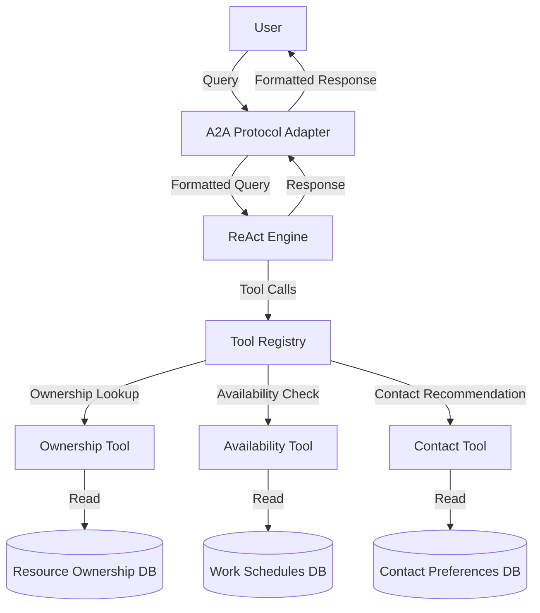

# Owner AI Agent Design

This document outlines the design of the Owner AI Agent, which is part of the Instana integration. The Owner AI Agent helps users identify resource owners and determine the best way to contact them based on availability and time of day.

## 1. Architecture Overview

The Owner AI Agent is built using the ReAct (Reasoning + Acting) pattern, which allows it to reason about user queries and take appropriate actions to fulfill them. The agent is implemented as a Node.js application that exposes an HTTP API for communication.



## 2. File Structure

```
owner-ai-agent/
├── src/
│   ├── index.js                 # Main entry point
│   ├── config.js                # Configuration loader
│   ├── agent.js                 # Main agent implementation
│   ├── react/                   # ReAct pattern implementation
│   │   ├── engine.js            # ReAct reasoning engine
│   │   ├── prompts.js           # ReAct prompts
│   │   └── state.js             # State management
│   ├── tools/                   # Tool implementations
│   │   ├── index.js             # Tool registry
│   │   ├── ownership.js         # Resource ownership lookup
│   │   ├── availability.js      # On-duty status checking
│   │   └── contact.js           # Contact recommendation
│   ├── data/                    # Data sources
│   │   ├── resources.js         # Resource ownership database
│   │   ├── schedules.js         # Work schedules and availability
│   │   └── contacts.js          # Contact preferences
│   └── a2a/                     # A2A protocol implementation
│       ├── adapter.js           # A2A protocol adapter
│       ├── handlers.js          # Message handlers
│       └── schema.js            # Message schemas
├── config/
│   └── default.json             # Default configuration
├── package.json                 # Node.js package file
├── README.md                    # Documentation
└── test/                        # Tests
    ├── react/                   # ReAct tests
    ├── tools/                   # Tool tests
    └── a2a/                     # A2A protocol tests
```

## 3. Configuration

The agent is configured using a JSON file (`config/default.json`) with the following structure:

```json
{
  "server": {
    "port": 3001,
    "host": "0.0.0.0",
    "logLevel": "info"
  },
  "agent": {
    "name": "owner-ai-agent",
    "description": "AI Agent for finding resource owners and contact information",
    "version": "1.0.0"
  },
  "react": {
    "maxIterations": 10,
    "maxResponseTokens": 1000,
    "temperature": 0.2
  },
  "llm": {
    "provider": "openai",
    "model": "gpt-4",
    "apiKey": "OPENAI_API_KEY"
  },
  "a2a": {
    "protocolVersion": "1.0",
    "capabilities": ["react", "tools", "memory"]
  },
  "data": {
    "resourcesFile": "./data/resources.json",
    "schedulesFile": "./data/schedules.json",
    "contactsFile": "./data/contacts.json"
  }
}
```

## 4. Main Components

### 4.1 ReAct Engine

The ReAct engine is responsible for processing user queries and generating responses. It uses a large language model (LLM) to reason about the query and decide which tools to use to fulfill it.

The engine follows these steps:
1. Receive a user query
2. Generate a thought about how to approach the problem
3. Select an appropriate tool to use
4. Execute the tool with the appropriate input
5. Observe the result of the tool execution
6. Generate a new thought based on the observation
7. Repeat steps 3-6 until a final answer is reached
8. Return the final answer to the user

### 4.2 Tool Registry

The tool registry manages all the tools available to the agent. Each tool has a name, description, parameters, and an execute function.

#### 4.2.1 Ownership Tool

The ownership tool is used to find the owner of a specific resource or list resources owned by a specific person or team.

**Tool: findResourceOwner**
- **Description**: Find the owner of a specific resource
- **Parameters**:
  - `resourceType`: Type of resource (e.g., database, server, application)
  - `resourceName`: Name of the resource
- **Returns**:
  - `owner`: Resource owner information
  - `team`: Team responsible for the resource

**Tool: listOwnedResources**
- **Description**: List resources owned by a specific person
- **Parameters**:
  - `ownerName`: Name of the owner
- **Returns**:
  - `resources`: List of resources owned by the person

**Tool: findTeamResources**
- **Description**: Find resources owned by a specific team
- **Parameters**:
  - `teamName`: Name of the team
- **Returns**:
  - `resources`: List of resources owned by the team

#### 4.2.2 Availability Tool

The availability tool is used to check if a person is currently on duty or to get the current on-call rotation for a team.

**Tool: checkOnDutyStatus**
- **Description**: Check if a person is currently on duty
- **Parameters**:
  - `personName`: Name of the person to check
- **Returns**:
  - `onDuty`: Whether the person is currently on duty
  - `status`: Current status (available, vacation, sick, etc.)

**Tool: getOnCallRotation**
- **Description**: Get the current on-call rotation for a team
- **Parameters**:
  - `teamName`: Name of the team
- **Returns**:
  - `onCall`: Person currently on call

#### 4.2.3 Contact Tool

The contact tool is used to recommend the best way to contact a person based on their preferences and current availability.

**Tool: getContactPreferences**
- **Description**: Get a person's contact preferences
- **Parameters**:
  - `personName`: Name of the person
- **Returns**:
  - `preferences`: List of contact methods in order of preference

**Tool: recommendContactMethod**
- **Description**: Recommend the best way to contact a person based on time and availability
- **Parameters**:
  - `personName`: Name of the person
  - `urgency`: Urgency level (low, medium, high)
- **Returns**:
  - `method`: Recommended contact method
  - `contact`: Contact information
  - `reason`: Reason for the recommendation

**Tool: notifyPerson**
- **Description**: Send a notification to a person using their preferred contact method
- **Parameters**:
  - `personName`: Name of the person
  - `message`: Message to send
  - `urgency`: Urgency level (low, medium, high)
- **Returns**:
  - `success`: Whether the notification was sent successfully
  - `method`: Contact method used
  - `timestamp`: Time the notification was sent

### 4.3 A2A Protocol Adapter

The A2A (Agent-to-Agent) protocol adapter is responsible for translating between the A2A protocol and the internal agent API. It handles incoming A2A messages and generates appropriate responses.

#### 4.3.1 Message Handlers

The message handlers process different types of A2A messages:

- **Query Handler**: Processes user queries and generates responses
- **Tool Call Handler**: Processes tool call requests from other agents
- **Status Handler**: Processes status requests from other agents

#### 4.3.2 Message Schema

The A2A protocol uses a JSON schema for messages:

```json
{
  "type": "query",
  "id": "123e4567-e89b-12d3-a456-426614174000",
  "timestamp": "2023-07-15T14:30:00Z",
  "sender": {
    "id": "user-123",
    "name": "User"
  },
  "content": {
    "query": "Who owns the database server DB001?"
  }
}
```

Response:

```json
{
  "type": "response",
  "id": "456e7890-e12b-34d5-a678-426614174000",
  "timestamp": "2023-07-15T14:30:05Z",
  "inResponseTo": "123e4567-e89b-12d3-a456-426614174000",
  "sender": {
    "id": "owner-ai-agent",
    "name": "Owner AI Agent"
  },
  "content": {
    "response": "The database server DB001 is owned by Jane Smith (jane.smith@example.com). She is currently available and can be reached via Slack or email.",
    "thinking": [
      {
        "thought": "I need to find the owner of the database server DB001.",
        "action": "findResourceOwner",
        "actionInput": {
          "resourceType": "database",
          "resourceName": "DB001"
        },
        "observation": "{\"found\":true,\"owner\":{\"name\":\"Jane Smith\",\"email\":\"jane.smith@example.com\",\"role\":\"Database Administrator\"},\"team\":\"Infrastructure\"}"
      },
      {
        "thought": "Now I need to check if Jane Smith is currently available.",
        "action": "checkOnDutyStatus",
        "actionInput": {
          "personName": "Jane Smith"
        },
        "observation": "{\"found\":true,\"onDuty\":true,\"status\":\"available\",\"details\":{\"timezone\":\"America/New_York\",\"workHours\":{\"start\":\"09:00\",\"end\":\"17:00\"},\"currentLocalTime\":\"14:30\"}}"
      },
      {
        "thought": "I should recommend the best way to contact Jane Smith.",
        "action": "getContactPreferences",
        "actionInput": {
          "personName": "Jane Smith"
        },
        "observation": "{\"found\":true,\"preferences\":[{\"method\":\"slack\",\"contact\":\"@janesmith\"},{\"method\":\"email\",\"contact\":\"jane.smith@example.com\"},{\"method\":\"phone\",\"contact\":\"+1-555-123-4567\"}]}"
      }
    ]
  }
}
```

## 5. Data Models

### 5.1 Resource Ownership

```json
[
  {
    "type": "database",
    "name": "DB001",
    "description": "Main production database",
    "owner": {
      "name": "Jane Smith",
      "email": "jane.smith@example.com",
      "role": "Database Administrator"
    },
    "team": "Infrastructure",
    "backupOwners": [
      {
        "name": "John Doe",
        "email": "john.doe@example.com",
        "role": "Senior Database Administrator"
      }
    ]
  }
]
```

### 5.2 Work Schedules

```json
[
  {
    "name": "Jane Smith",
    "email": "jane.smith@example.com",
    "timezone": "America/New_York",
    "team": "Infrastructure",
    "workHours": {
      "monday": { "start": "09:00", "end": "17:00" },
      "tuesday": { "start": "09:00", "end": "17:00" },
      "wednesday": { "start": "09:00", "end": "17:00" },
      "thursday": { "start": "09:00", "end": "17:00" },
      "friday": { "start": "09:00", "end": "17:00" }
    },
    "vacations": [
      {
        "startDate": "2023-08-01",
        "endDate": "2023-08-15",
        "note": "Summer vacation"
      }
    ],
    "sickLeave": null,
    "contact": {
      "slack": "@janesmith",
      "email": "jane.smith@example.com",
      "phone": "+1-555-123-4567"
    }
  }
]
```

### 5.3 Contact Preferences

```json
[
  {
    "name": "Jane Smith",
    "email": "jane.smith@example.com",
    "preferences": [
      {
        "method": "slack",
        "contact": "@janesmith",
        "priority": 1,
        "hours": { "start": "09:00", "end": "17:00" },
        "daysOfWeek": ["monday", "tuesday", "wednesday", "thursday", "friday"]
      },
      {
        "method": "email",
        "contact": "jane.smith@example.com",
        "priority": 2,
        "hours": { "start": "00:00", "end": "23:59" },
        "daysOfWeek": ["monday", "tuesday", "wednesday", "thursday", "friday", "saturday", "sunday"]
      },
      {
        "method": "phone",
        "contact": "+1-555-123-4567",
        "priority": 3,
        "hours": { "start": "09:00", "end": "17:00" },
        "daysOfWeek": ["monday", "tuesday", "wednesday", "thursday", "friday"]
      }
    ],
    "emergencyContact": {
      "method": "phone",
      "contact": "+1-555-123-4567"
    },
    "doNotDisturb": {
      "hours": { "start": "22:00", "end": "07:00" },
      "daysOfWeek": ["monday", "tuesday", "wednesday", "thursday", "friday", "saturday", "sunday"]
    }
  }
]
```

## 6. Implementation Details

### 6.1 Contact Tool Implementation

The Contact Tool provides functionality to recommend the best way to contact a person based on their preferences, current time, and availability.

```javascript
const fs = require('fs').promises;
const path = require('path');
const config = require('config');
const winston = require('winston');
const moment = require('moment-timezone');

// Create logger
const logger = winston.createLogger({
  level: config.get('server.logLevel'),
  format: winston.format.combine(
    winston.format.timestamp(),
    winston.format.json()
  ),
  transports: [
    new winston.transports.Console()
  ]
});

// Contact preferences data
let contacts = [];

/**
 * Initialize the contact tool
 */
async function initialize() {
  try {
    const contactsFile = path.resolve(config.get('data.contactsFile'));
    const data = await fs.readFile(contactsFile, 'utf8');
    contacts = JSON.parse(data);
    logger.info(`Loaded ${contacts.length} contact records`);
  } catch (error) {
    logger.error('Failed to load contacts data:', error);
    // Initialize with empty array if file not found
    contacts = [];
  }
}

/**
 * Get a person's contact preferences
 */
const getContactPreferences = {
  description: 'Get a person\'s contact preferences',
  parameters: {
    personName: {
      type: 'string',
      description: 'Name of the person'
    }
  },
  returns: {
    preferences: {
      type: 'array',
      description: 'List of contact methods in order of preference'
    }
  },
  async execute({ personName }) {
    logger.debug(`Getting contact preferences for ${personName}`);
    
    // Find person's contact preferences
    const person = contacts.find(p => 
      p.name.toLowerCase().includes(personName.toLowerCase())
    );
    
    if (!person) {
      return {
        found: false,
        message: `No contact preferences found for ${personName}`
      };
    }
    
    return {
      found: true,
      preferences: person.preferences.map(p => ({
        method: p.method,
        contact: p.contact,
        priority: p.priority
      }))
    };
  }
};

/**
 * Recommend the best way to contact a person based on time and availability
 */
const recommendContactMethod = {
  description: 'Recommend the best way to contact a person based on time and availability',
  parameters: {
    personName: {
      type: 'string',
      description: 'Name of the person'
    },
    urgency: {
      type: 'string',
      description: 'Urgency level (low, medium, high)'
    }
  },
  returns: {
    method: {
      type: 'string',
      description: 'Recommended contact method'
    },
    contact: {
      type: 'string',
      description: 'Contact information'
    },
    reason: {
      type: 'string',
      description: 'Reason for the recommendation'
    }
  },
  async execute({ personName, urgency }) {
    logger.debug(`Recommending contact method for ${personName} with urgency ${urgency}`);
    
    // Find person's contact preferences
    const person = contacts.find(p => 
      p.name.toLowerCase().includes(personName.toLowerCase())
    );
    
    if (!person) {
      return {
        found: false,
        message: `No contact preferences found for ${personName}`
      };
    }
    
    // Get current time in person's timezone
    const now = moment().tz(person.timezone || 'UTC');
    const currentHour = now.format('HH:mm');
    const currentDay = now.format('dddd').toLowerCase();
    
    // Check if in do not disturb hours
    const inDoNotDisturb = person.doNotDisturb && 
      person.doNotDisturb.daysOfWeek.includes(currentDay) &&
      currentHour >= person.doNotDisturb.hours.start &&
      currentHour <= person.doNotDisturb.hours.end;
    
    // If high urgency, use emergency contact
    if (urgency === 'high') {
      if (person.emergencyContact) {
        return {
          found: true,
          method: person.emergencyContact.method,
          contact: person.emergencyContact.contact,
          reason: 'High urgency requires immediate attention'
        };
      }
    }
    
    // If in do not disturb and not high urgency, use email
    if (inDoNotDisturb && urgency !== 'high') {
      const emailPref = person.preferences.find(p => p.method === 'email');
      if (emailPref) {
        return {
          found: true,
          method: 'email',
          contact: emailPref.contact,
          reason: 'Person is in do not disturb hours, email is recommended'
        };
      }
    }
    
    // Find available contact methods based on current time and day
    const availableMethods = person.preferences.filter(p => 
      p.daysOfWeek.includes(currentDay) &&
      currentHour >= p.hours.start &&
      currentHour <= p.hours.end
    );
    
    if (availableMethods.length === 0) {
      // If no available methods, use email as fallback
      const emailPref = person.preferences.find(p => p.method === 'email');
      if (emailPref) {
        return {
          found: true,
          method: 'email',
          contact: emailPref.contact,
          reason: 'No contact methods available at this time, email is recommended as fallback'
        };
      }
      
      // If no email, use first preference
      return {
        found: true,
        method: person.preferences[0].method,
        contact: person.preferences[0].contact,
        reason: 'No contact methods available at this time, using default preference'
      };
    }
    
    // Sort by priority
    availableMethods.sort((a, b) => a.priority - b.priority);
    
    // Return highest priority method
    return {
      found: true,
      method: availableMethods[0].method,
      contact: availableMethods[0].contact,
      reason: `${availableMethods[0].method} is the preferred contact method at this time`
    };
  }
};

/**
 * Send a notification to a person using their preferred contact method
 */
const notifyPerson = {
  description: 'Send a notification to a person using their preferred contact method',
  parameters: {
    personName: {
      type: 'string',
      description: 'Name of the person'
    },
    message: {
      type: 'string',
      description: 'Message to send'
    },
    urgency: {
      type: 'string',
      description: 'Urgency level (low, medium, high)'
    }
  },
  returns: {
    success: {
      type: 'boolean',
      description: 'Whether the notification was sent successfully'
    },
    method: {
      type: 'string',
      description: 'Contact method used'
    },
    timestamp: {
      type: 'string',
      description: 'Time the notification was sent'
    }
  },
  async execute({ personName, message, urgency }) {
    logger.debug(`Sending notification to ${personName} with urgency ${urgency}`);
    
    // First, get recommended contact method
    const recommendation = await recommendContactMethod.execute({ personName, urgency });
    
    if (!recommendation.found) {
      return {
        success: false,
        message: recommendation.message
      };
    }
    
    // In a real implementation, this would integrate with notification services
    // For now, we'll just log the notification
    logger.info(`Notification sent to ${personName} via ${recommendation.method} (${recommendation.contact}): ${message}`);
    
    return {
      success: true,
      method: recommendation.method,
      contact: recommendation.contact,
      timestamp: new Date().toISOString()
    };
  }
};

module.exports = {
  initialize,
  'getContactPreferences': getContactPreferences,
  'recommendContactMethod': recommendContactMethod,
  'notifyPerson': notifyPerson
};
```

### 6.2 A2A Protocol Adapter

The A2A Protocol Adapter translates between the A2A protocol and the internal agent API.

```javascript
const winston = require('winston');
const config = require('config');
const { v4: uuidv4 } = require('uuid');
const agent = require('../agent');
const schema = require('./schema');

// Create logger
const logger = winston.createLogger({
  level: config.get('server.logLevel'),
  format: winston.format.combine(
    winston.format.timestamp(),
    winston.format.json()
  ),
  transports: [
    new winston.transports.Console()
  ]
});

/**
 * Handle an incoming A2A message
 */
async function handleMessage(message) {
  logger.debug('Handling A2A message', { messageType: message.type });
  
  try {
    // Validate message against schema
    const validationResult = schema.validateMessage(message);
    if (!validationResult.valid) {
      return createErrorResponse(message, 'invalid_message', validationResult.errors.join(', '));
    }
    
    // Handle different message types
    switch (message.type) {
      case 'query':
        return handleQueryMessage(message);
      case 'tool_call':
        return handleToolCallMessage(message);
      case 'status':
        return handleStatusMessage(message);
      default:
        return createErrorResponse(message, 'unsupported_message_type', `Message type '${message.type}' is not supported`);
    }
  } catch (error) {
    logger.error('Error handling A2A message:', error);
    return createErrorResponse(message, 'internal_error', error.message);
  }
}

/**
 * Handle a query message
 */
async function handleQueryMessage(message) {
  const query = message.content.query;
  
  try {
    // Process query with agent
    const result = await agent.processQuery(query, message.id);
    
    // Create response
    return {
      type: 'response',
      id: uuidv4(),
      timestamp: new Date().toISOString(),
      inResponseTo: message.id,
      sender: {
        id: config.get('agent.name'),
        name: config.get('agent.name')
      },
      content: {
        response: result.response,
        thinking: result.thinking
      }
    };
  } catch (error) {
    logger.error('Error processing query:', error);
    return createErrorResponse(message, 'query_processing_error', error.message);
  }
}

/**
 * Handle a tool call message
 */
async function handleToolCallMessage(message) {
  const toolName = message.content.tool;
  const toolInput = message.content.input;
  
  try {
    // Get tool
    const tools = agent.getTools();
    const tool = tools.find(t => t.name === toolName);
    
    if (!tool) {
      return createErrorResponse(message, 'tool_not_found', `Tool '${toolName}' not found`);
    }
    
    // Execute tool
    const result = await tool.execute(toolInput);
    
    // Create response
    return {
      type: 'tool_result',
      id: uuidv4(),
      timestamp: new Date().toISOString(),
      inResponseTo: message.id,
      sender: {
        id: config.get('agent.name'),
        name: config.get('agent.name')
      },
      content: {
        tool: toolName,
        result
      }
    };
  } catch (error) {
    logger.error('Error executing tool:', error);
    return createErrorResponse(message, 'tool_execution_error', error.message);
  }
}

/**
 * Handle a status message
 */
async function handleStatusMessage(message) {
  try {
    // Get agent info
    const info = agent.getInfo();
    
    // Create response
    return {
      type: 'status_response',
      id: uuidv4(),
      timestamp: new Date().toISOString(),
      inResponseTo: message.id,
      sender: {
        id: config.get('agent.name'),
        name: config.get('agent.name')
      },
      content: {
        status: 'ok',
        info
      }
    };
  } catch (error) {
    logger.error('Error getting agent status:', error);
    return createErrorResponse(message, 'status_error', error.message);
  }
}

/**
 * Create an error response
 */
function createErrorResponse(message, code, errorMessage) {
  return {
    type: 'error',
    id: uuidv4(),
    timestamp: new Date().toISOString(),
    inResponseTo: message?.id,
    sender: {
      id: config.get('agent.name'),
      name: config.get('agent.name')
    },
    content: {
      error: {
        code,
        message: errorMessage
      }
    }
  };
}

module.exports = {
  handleMessage
};
```

## 7. Integration with MCP Gateway

The Owner AI Agent will be registered with the MCP Gateway using the registration scripts. This will allow the agent to be discovered and used by other components in the system.

### 7.1 Registration Process

1. The registration script will call the MCP Gateway API to register the Owner AI Agent
2. The MCP Gateway will assign a unique ID to the agent
3. The agent will be available for use by other components through the MCP Gateway

### 7.2 API Endpoints

The Owner AI Agent exposes the following API endpoints:

- `POST /a2a/message`: Handle A2A protocol messages
- `GET /health`: Health check endpoint

## 8. Example Usage Scenarios

### 8.1 Finding a Resource Owner

**User Query**: "Who owns the database server DB001?"

**Agent Process**:
1. Use the `findResourceOwner` tool to look up the owner of DB001
2. Use the `checkOnDutyStatus` tool to check if the owner is currently available
3. Use the `getContactPreferences` tool to get the owner's contact preferences
4. Generate a response with the owner's information, availability, and contact methods

**Response**: "The database server DB001 is owned by Jane Smith (jane.smith@example.com). She is currently available and can be reached via Slack (@janesmith) or email."

### 8.2 Recommending a Contact Method

**User Query**: "What's the best way to contact John Doe about an urgent issue with the web server?"

**Agent Process**:
1. Use the `findResourceOwner` tool to look up the owner of the web server
2. Confirm that John Doe is the owner
3. Use the `checkOnDutyStatus` tool to check if John is currently available
4. Use the `recommendContactMethod` tool to get the recommended contact method for urgent issues
5. Generate a response with the recommended contact method

**Response**: "For an urgent issue with the web server, the best way to contact John Doe is by phone at +1-555-987-6543. He is currently on duty and this is his preferred contact method for urgent issues."

### 8.3 Finding On-Call Support

**User Query**: "Who is on call for the Infrastructure team right now?"

**Agent Process**:
1. Use the `getOnCallRotation` tool to get the current on-call rotation for the Infrastructure team
2. Use the `checkOnDutyStatus` tool to check if the on-call person is available
3. Use the `getContactPreferences` tool to get the on-call person's contact preferences
4. Generate a response with the on-call person's information and contact methods

**Response**: "Jane Smith is currently on call for the Infrastructure team. She is available and can be reached via Slack (@janesmith) or phone (+1-555-123-4567)."