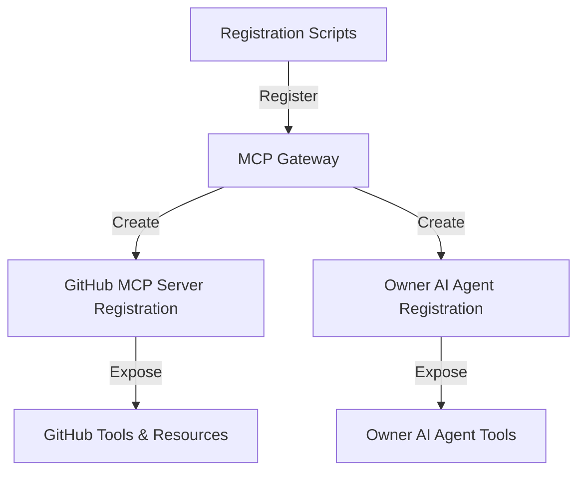

# Registration Scripts Design

This document outlines the design of the registration scripts for the Instana integration. These scripts are responsible for registering the GitHub MCP server and the Owner AI Agent with the MCP Gateway.

## 1. Overview

The registration scripts are Node.js scripts that use the MCP Gateway REST API to register the GitHub MCP server and the Owner AI Agent. The scripts are designed to be run as part of the deployment process or manually by an administrator.



## 2. File Structure

```
registration-scripts/
├── src/
│   ├── index.js                 # Main entry point
│   ├── config.js                # Configuration loader
│   ├── github-server.js         # GitHub MCP server registration
│   ├── owner-agent.js           # Owner AI Agent registration
│   └── utils/
│       ├── api.js               # API client for MCP Gateway
│       └── logger.js            # Logging utilities
├── config/
│   └── default.json             # Default configuration
├── package.json                 # Node.js package file
└── README.md                    # Documentation
```

## 3. Configuration

The registration scripts are configured using a JSON file (`config/default.json`) with the following structure:

```json
{
  "mcpGateway": {
    "url": "http://localhost:8000",
    "apiKey": "YOUR_API_KEY_HERE"
  },
  "githubServer": {
    "name": "github-mcp-server",
    "description": "MCP server for GitHub integration",
    "url": "http://localhost:3000",
    "type": "remote"
  },
  "ownerAgent": {
    "name": "owner-ai-agent",
    "description": "AI Agent for finding resource owners",
    "url": "http://localhost:3001",
    "type": "remote"
  },
  "logging": {
    "level": "info"
  }
}
```

## 4. Main Components

### 4.1 API Client

The API client is responsible for communicating with the MCP Gateway REST API. It handles authentication, request formatting, and error handling.

```javascript
const axios = require('axios');
const config = require('config');
const logger = require('./logger');

class ApiClient {
  constructor() {
    this.baseUrl = config.get('mcpGateway.url');
    this.apiKey = config.get('mcpGateway.apiKey');
    
    this.client = axios.create({
      baseURL: this.baseUrl,
      headers: {
        'Authorization': `Bearer ${this.apiKey}`,
        'Content-Type': 'application/json'
      }
    });
    
    // Add request interceptor for logging
    this.client.interceptors.request.use(request => {
      logger.debug('API Request', {
        method: request.method,
        url: request.url
      });
      return request;
    });
    
    // Add response interceptor for logging
    this.client.interceptors.response.use(
      response => {
        logger.debug('API Response', {
          status: response.status,
          statusText: response.statusText
        });
        return response;
      },
      error => {
        logger.error('API Error', {
          status: error.response?.status,
          statusText: error.response?.statusText,
          data: error.response?.data
        });
        return Promise.reject(error);
      }
    );
  }
  
  /**
   * Register a server with the MCP Gateway
   */
  async registerServer(server) {
    try {
      const response = await this.client.post('/api/v1/servers', server);
      return response.data;
    } catch (error) {
      logger.error('Failed to register server', { error: error.message });
      throw error;
    }
  }
  
  /**
   * Register an agent with the MCP Gateway
   */
  async registerAgent(agent) {
    try {
      const response = await this.client.post('/api/v1/agents', agent);
      return response.data;
    } catch (error) {
      logger.error('Failed to register agent', { error: error.message });
      throw error;
    }
  }
  
  /**
   * Get a list of registered servers
   */
  async getServers() {
    try {
      const response = await this.client.get('/api/v1/servers');
      return response.data;
    } catch (error) {
      logger.error('Failed to get servers', { error: error.message });
      throw error;
    }
  }
  
  /**
   * Get a list of registered agents
   */
  async getAgents() {
    try {
      const response = await this.client.get('/api/v1/agents');
      return response.data;
    } catch (error) {
      logger.error('Failed to get agents', { error: error.message });
      throw error;
    }
  }
  
  /**
   * Delete a server registration
   */
  async deleteServer(serverId) {
    try {
      const response = await this.client.delete(`/api/v1/servers/${serverId}`);
      return response.data;
    } catch (error) {
      logger.error('Failed to delete server', { error: error.message });
      throw error;
    }
  }
  
  /**
   * Delete an agent registration
   */
  async deleteAgent(agentId) {
    try {
      const response = await this.client.delete(`/api/v1/agents/${agentId}`);
      return response.data;
    } catch (error) {
      logger.error('Failed to delete agent', { error: error.message });
      throw error;
    }
  }
}

module.exports = new ApiClient();
```

### 4.2 GitHub MCP Server Registration

The GitHub MCP server registration script is responsible for registering the GitHub MCP server with the MCP Gateway.

```javascript
const config = require('config');
const logger = require('./utils/logger');
const api = require('./utils/api');

/**
 * Register the GitHub MCP server with the MCP Gateway
 */
async function registerGitHubServer() {
  logger.info('Registering GitHub MCP server');
  
  const serverConfig = config.get('githubServer');
  
  // Check if server already exists
  const servers = await api.getServers();
  const existingServer = servers.find(s => s.name === serverConfig.name);
  
  if (existingServer) {
    logger.info('GitHub MCP server already registered', { serverId: existingServer.id });
    return existingServer;
  }
  
  // Register server
  const server = {
    name: serverConfig.name,
    description: serverConfig.description,
    url: serverConfig.url,
    type: serverConfig.type,
    metadata: {
      provider: 'github',
      version: '1.0.0'
    }
  };
  
  const result = await api.registerServer(server);
  logger.info('GitHub MCP server registered successfully', { serverId: result.id });
  
  return result;
}

/**
 * Unregister the GitHub MCP server from the MCP Gateway
 */
async function unregisterGitHubServer() {
  logger.info('Unregistering GitHub MCP server');
  
  const serverConfig = config.get('githubServer');
  
  // Check if server exists
  const servers = await api.getServers();
  const existingServer = servers.find(s => s.name === serverConfig.name);
  
  if (!existingServer) {
    logger.info('GitHub MCP server not registered');
    return;
  }
  
  // Unregister server
  await api.deleteServer(existingServer.id);
  logger.info('GitHub MCP server unregistered successfully', { serverId: existingServer.id });
}

module.exports = {
  registerGitHubServer,
  unregisterGitHubServer
};
```

### 4.3 Owner AI Agent Registration

The Owner AI Agent registration script is responsible for registering the Owner AI Agent with the MCP Gateway.

```javascript
const config = require('config');
const logger = require('./utils/logger');
const api = require('./utils/api');

/**
 * Register the Owner AI Agent with the MCP Gateway
 */
async function registerOwnerAgent() {
  logger.info('Registering Owner AI Agent');
  
  const agentConfig = config.get('ownerAgent');
  
  // Check if agent already exists
  const agents = await api.getAgents();
  const existingAgent = agents.find(a => a.name === agentConfig.name);
  
  if (existingAgent) {
    logger.info('Owner AI Agent already registered', { agentId: existingAgent.id });
    return existingAgent;
  }
  
  // Register agent
  const agent = {
    name: agentConfig.name,
    description: agentConfig.description,
    url: agentConfig.url,
    type: agentConfig.type,
    capabilities: ['react', 'tools', 'memory'],
    metadata: {
      version: '1.0.0'
    }
  };
  
  const result = await api.registerAgent(agent);
  logger.info('Owner AI Agent registered successfully', { agentId: result.id });
  
  return result;
}

/**
 * Unregister the Owner AI Agent from the MCP Gateway
 */
async function unregisterOwnerAgent() {
  logger.info('Unregistering Owner AI Agent');
  
  const agentConfig = config.get('ownerAgent');
  
  // Check if agent exists
  const agents = await api.getAgents();
  const existingAgent = agents.find(a => a.name === agentConfig.name);
  
  if (!existingAgent) {
    logger.info('Owner AI Agent not registered');
    return;
  }
  
  // Unregister agent
  await api.deleteAgent(existingAgent.id);
  logger.info('Owner AI Agent unregistered successfully', { agentId: existingAgent.id });
}

module.exports = {
  registerOwnerAgent,
  unregisterOwnerAgent
};
```

### 4.4 Main Entry Point

The main entry point is responsible for parsing command-line arguments and executing the appropriate registration or unregistration functions.

```javascript
const logger = require('./utils/logger');
const githubServer = require('./github-server');
const ownerAgent = require('./owner-agent');

/**
 * Main function
 */
async function main() {
  try {
    const args = process.argv.slice(2);
    const command = args[0];
    const target = args[1];
    
    if (!command) {
      console.log('Usage: node index.js <command> <target>');
      console.log('Commands: register, unregister');
      console.log('Targets: github-server, owner-agent, all');
      return;
    }
    
    switch (command) {
      case 'register':
        await handleRegister(target);
        break;
      case 'unregister':
        await handleUnregister(target);
        break;
      default:
        console.log(`Unknown command: ${command}`);
        break;
    }
  } catch (error) {
    logger.error('Error in main function', { error: error.message });
    process.exit(1);
  }
}

/**
 * Handle register command
 */
async function handleRegister(target) {
  switch (target) {
    case 'github-server':
      await githubServer.registerGitHubServer();
      break;
    case 'owner-agent':
      await ownerAgent.registerOwnerAgent();
      break;
    case 'all':
      await githubServer.registerGitHubServer();
      await ownerAgent.registerOwnerAgent();
      break;
    default:
      console.log(`Unknown target: ${target}`);
      break;
  }
}

/**
 * Handle unregister command
 */
async function handleUnregister(target) {
  switch (target) {
    case 'github-server':
      await githubServer.unregisterGitHubServer();
      break;
    case 'owner-agent':
      await ownerAgent.unregisterOwnerAgent();
      break;
    case 'all':
      await githubServer.unregisterGitHubServer();
      await ownerAgent.unregisterOwnerAgent();
      break;
    default:
      console.log(`Unknown target: ${target}`);
      break;
  }
}

// Run main function
main().catch(error => {
  logger.error('Unhandled error', { error: error.message });
  process.exit(1);
});
```

## 5. Package.json

```json
{
  "name": "registration-scripts",
  "version": "1.0.0",
  "description": "Scripts for registering Instana integration components with MCP Gateway",
  "main": "src/index.js",
  "scripts": {
    "register:github": "node src/index.js register github-server",
    "register:owner": "node src/index.js register owner-agent",
    "register:all": "node src/index.js register all",
    "unregister:github": "node src/index.js unregister github-server",
    "unregister:owner": "node src/index.js unregister owner-agent",
    "unregister:all": "node src/index.js unregister all"
  },
  "dependencies": {
    "axios": "^1.4.0",
    "config": "^3.3.9",
    "winston": "^3.10.0"
  }
}
```

## 6. Usage

### 6.1 Installation

```bash
cd registration-scripts
npm install
```

### 6.2 Configuration

Create a `config/default.json` file with the appropriate configuration:

```json
{
  "mcpGateway": {
    "url": "http://localhost:8000",
    "apiKey": "YOUR_API_KEY_HERE"
  },
  "githubServer": {
    "name": "github-mcp-server",
    "description": "MCP server for GitHub integration",
    "url": "http://localhost:3000",
    "type": "remote"
  },
  "ownerAgent": {
    "name": "owner-ai-agent",
    "description": "AI Agent for finding resource owners",
    "url": "http://localhost:3001",
    "type": "remote"
  },
  "logging": {
    "level": "info"
  }
}
```

### 6.3 Registration

To register the GitHub MCP server:

```bash
npm run register:github
```

To register the Owner AI Agent:

```bash
npm run register:owner
```

To register both components:

```bash
npm run register:all
```

### 6.4 Unregistration

To unregister the GitHub MCP server:

```bash
npm run unregister:github
```

To unregister the Owner AI Agent:

```bash
npm run unregister:owner
```

To unregister both components:

```bash
npm run unregister:all
```

## 7. Error Handling

The registration scripts include comprehensive error handling to ensure that any issues during registration or unregistration are properly logged and reported. The scripts will:

1. Log detailed error information
2. Return appropriate error codes
3. Provide clear error messages to the user

## 8. Security Considerations

The registration scripts use API keys for authentication with the MCP Gateway. The API keys are stored in the configuration file, which should be kept secure and not committed to version control.

In a production environment, consider using environment variables or a secure secrets management system to store the API keys.